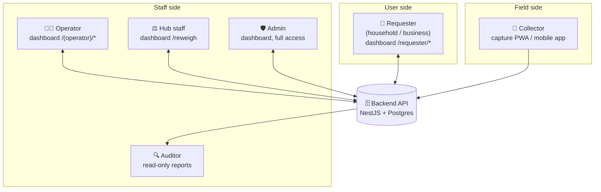

# 1. System Map

## The four apps

| App | Stack | Who uses it | Path |
| --- | --- | --- | --- |
| **Backend** | NestJS + Postgres + Redis | Nobody directly — it is the single source of truth | `apps/backend` |
| **Dashboard** | Next.js 15 (App Router) | Two audiences in one deployment: **users/requesters** and **admin/operators** | `apps/dashboard` |
| **Capture** | Vite PWA, offline-first | **Collectors** in the field | `apps/capture` |
| **Mobile** | Expo / React Native | **Collectors** — same job as capture, native shell | `apps/mobile` |

The dashboard is one Next.js app with **two separate route groups and two
separate login systems**:

- `src/app/requester/*` — the user-facing side (signup, request, dashboard,
  wallet, rewards, history). Authenticated by a **requester** JWT.
- `src/app/(operator)/*` — the staff side (batches, weigh-ins, reweigh, payouts,
  requests, withdrawals, materials, rates, catalog). Authenticated by a **user**
  JWT carrying a role: `admin`, `operator`, or `auditor`.

These are two different identity tables and two different guards. A requester
can never reach an operator route and vice versa.

## Actors



**There is no direct app-to-app communication.** Capture never calls the
dashboard; the dashboard never calls capture. Every interaction between a user
and a collector is mediated by backend state — a request row, an event row, a
redemption code. That is deliberate: it means the phone can be offline for
hours and nothing breaks.

The dashboard and capture are nonetheless **connected in both directions**, via
that shared state: a request a user books appears on the collector's phone
within 45 seconds, and a code the collector mints at the door is redeemable on
the user's dashboard immediately.

## Auth boundaries

| Caller | Credential | Obtained via |
| --- | --- | --- |
| Requester (user) | Requester JWT | `POST /requesters/login` |
| Staff (admin/operator/auditor) | User JWT with `role` claim | `POST /auth/login` |
| Collector's phone | **ed25519 device signature** — no token at all | Device enrolled once by an operator via `POST /devices` |

The last row is the important one. A field phone holds **no standing
credentials**. The signature on each weigh-in payload *is* the credential. An
operator signs in once on the phone to enrol its public key, and that token is
never persisted (`apps/capture/src/lib/api.ts` — `operatorLogin`). This is what
lets capture work fully offline and why a stolen phone cannot be used to read
anyone's data.

That extends to reads and to doorstep collections. There is no payload to sign
on a `GET`, so the phone signs the **request line** itself — method, path,
device id, timestamp, nonce and a hash of the body — with the same key, and
`DeviceAuthGuard` verifies it (see
[device-auth.ts](../packages/shared/src/device-auth.ts)). That is what let the
collector's job feed exist without ever putting a standing credential on a
shared phone. The body hash matters specifically on
`POST /requests/:id/collect`: without it a captured signature could be replayed
against a different weight.

## API surface by controller

```
auth              POST /auth/login
requesters        POST /requesters/register | /login    GET /requesters/me
requests          POST /requests             (requester)
                  GET  /requests/mine        (requester)
                  GET  /requests/assigned    (DEVICE-SIGNED - the collector's job list)
                  POST /requests/:id/collect (DEVICE-SIGNED - doorstep, issues the code)
                  GET  /requests             (admin, operator)
                  POST /requests/:id/assign  (admin, operator)
                  POST /requests/:id/fulfill (admin, operator)  ← issues the code
                  POST /requests/:id/cancel  (admin, operator)
events            POST /events               (public — device signature is auth)
                  POST /events/:id/photo     (public — hash-checked)
reweigh           GET  /events/:id/reweigh   (public)
                  POST /events/:id/reweigh   (admin, operator)
wallet            GET  /wallet               (requester)
                  POST /wallet/redeem        (requester)  ← redeems the QR code
                  POST /wallet/withdraw      (requester)
                  POST /wallet/redeem-catalog-item (requester)
                  GET  /wallet/withdrawals   (admin, operator)
                  POST /wallet/withdrawals/:id/mark-paid | /reject (admin, operator)
credit-rates      GET  /credit-rates (public)   POST /credit-rates (admin)
material-rates    GET  (admin, operator)        POST (admin)
materials         GET  (public)                 POST/PATCH (admin)
catalog-items     GET  (public)                 POST (admin)
catalog-redemptions GET / :id/fulfill           (admin, operator)
batches           all (admin, operator)         GET /batches/:id/report
payouts           GET (admin, operator, auditor)  POST (admin, operator)
collectors        GET/POST (admin, operator)    delete/deactivate (admin)
users             all (admin only)
```

Two rate tables exist and they are not the same thing:

- **`material_rates`** → cash **payouts to collectors**, in currency per kg.
- **`credit_rates`** → wallet **credits to requesters**, in credits per kg.

Both resolve the same way: most specific `hubId` match beats the global
`hubId: null` default, and within a tier the latest `effectiveFrom` at or before
now wins.

## Data the workflow turns on

| Table | Role in the flow |
| --- | --- |
| `collection_requests` | The user's pickup ask. Carries `status`, `eventId`, `redemptionCode`, `redeemedAt`, optional `latitude`/`longitude`, and `creditedWeightKg`/`reconciledAt` for doorstep settlement |
| `collection_events` | One signed weigh-in from a collector's phone |
| `event_reweighs` | The hub's independent weight. Always what a collector is *paid*; for a doorstep pickup it arrives after the requester was credited and settles the difference |
| `waste_wallets` | One per requester. **Carries no balance column** — balance is always summed from the ledger |
| `wallet_transactions` | The credit/debit ledger. Balance = `SUM(credit) − SUM(debit)` |
| `credit_rates` | Credits per kg, per material, optionally per hub |
| `withdrawal_requests` | Cash-out asks, pending until an operator marks them paid |
| `catalog_items` / `catalog_redemptions` | The rewards store |
