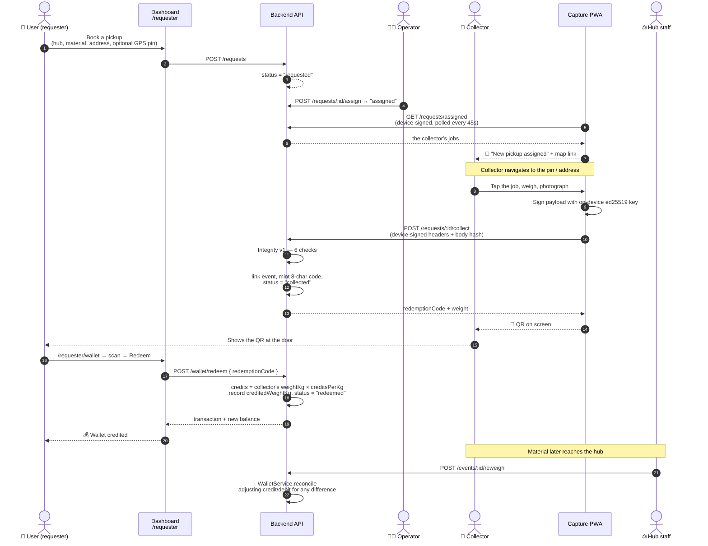
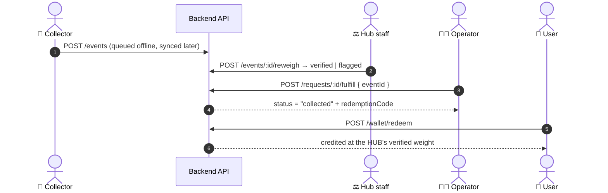
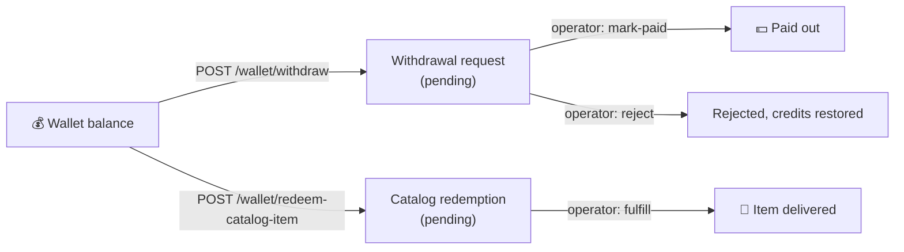

# 2. The Collection Workflow

Request → collect → weigh → verify → QR → credit.

This is the flow the product exists for: a user with waste, a collector who
comes to get it, and credits that land in the user's wallet.

There are **two ways a pickup completes**. A *doorstep* collection issues the
code on the collector's phone at the gate, priced off their scale and
reconciled against the hub later. An *operator* fulfillment links a weigh-in
the hub has already verified, priced off the hub's figure. Both end in the same
redemption.

## The request lifecycle

Every pickup is one row in `collection_requests`, moving through exactly these
states (`apps/backend/src/requests/requests.service.ts`):

```
requested ──(assign)──> assigned ──(fulfill)──> collected ──(redeem)──> redeemed
    │                       │
    └──────(cancel)─────────┴──> cancelled
```

- `assigned` is **optional** — both `fulfill` and `collect` accept a request
  that is still `requested`, so a collector can pick up an unassigned job. An
  *assigned* job, though, can only be collected by the collector it was
  assigned to.
- `cancel` is only legal from `requested` or `assigned`, and is **operator-only**
  today (a requester cannot cancel their own request yet).
- Two transitions reach `collected`, and which one runs decides what the
  requester is credited for:
  - **`collect`** (doorstep, from the capture app) ingests the collector's
    signed weigh-in and issues the code on the spot. The credit is computed
    from the collector's scale, then reconciled against the hub's later
    re-weigh.
  - **`fulfill`** (operator, from the dashboard) links a weigh-in the hub has
    *already* re-weighed. The credit is the hub's figure, with nothing to
    reconcile.
- `redeem` is terminal. Each code redeems exactly once.

## End-to-end sequence (doorstep)

This is the default path: the collector issues the code at the door.



## The operator path (hub-verified)

Unchanged, and still the right shape when the material reaches the hub before
anyone is paid — B2B collection, or a doorstep pickup the collector could not
complete for lack of signal.



## Step by step, with the code that does it

### 1. The user books a pickup

`apps/dashboard/src/app/requester/request/RequestForm.tsx` → `POST /requests`.

The user picks a **hub**, a **material**, an optional **estimated weight**, an
**address** and **notes**. The estimate is advisory only — nothing is ever paid
or credited off it. `RequestsService.create` validates the hub exists and the
material code is known, then saves with `status: "requested"` and every
downstream field (`eventId`, `redemptionCode`, `redeemedAt`) explicitly null.

### 2. The operator triages the queue

`/(operator)/requests` lists every request, filterable by status and hub. The
operator can assign a collector (`POST /requests/:id/assign`), which requires
the request still be exactly `"requested"`.

Assigning is what puts the job on a phone. The capture app polls
`GET /requests/assigned` every 45 seconds and raises a notification through its
service worker, so the collector learns about it without anyone calling them.

### 3. The collector captures the weigh-in

In `apps/capture` (or `apps/mobile`), the collector:

1. Picks the active hub and material.
2. Reads the weight — from a **paired Bluetooth scale** (`lib/scale.ts`) or
   typed in manually.
3. Takes a photo; the app computes its SHA-256.
4. Builds the payload (schema, collector id, hub id, device id, weight,
   material, photo hash, timestamp, nonce) and **signs it on-device** with an
   ed25519 private key that never leaves the phone (`lib/identity.ts`).
5. Queues it in IndexedDB (`lib/queue.ts`) and syncs when there is signal.

The weigh-in and the photo are sent as **two separate requests** on purpose
(`lib/api.ts`): the signed record is a few hundred bytes and carries the weight,
the location and the signature; the photo is megabytes. On a bad field link the
record must be able to land on its own, so a collector never ends a day with
nothing recorded. Photos that fail get retried on a later sync pass.

Retries are safe by construction — the server keys events on the payload hash
with a unique index, so re-sending a record it already holds returns the
original event instead of creating a duplicate.

### 4. The server checks integrity

`POST /events` runs **Integrity v1** — six checks: device enrolled, signature
valid, weight within the hub's range, not a duplicate, clock plausible, photo
hash is a well-formed SHA-256. Any *fail* quarantines the event, and a
quarantined event can never enter a batch or fulfill a request. The collector
sees a human-readable reason in their queue row, not a check name, because they
are the person who can still go back and fix it.

### 5. The hub re-weighs

`/(operator)/reweigh` → `POST /events/:eventId/reweigh`.

Hub staff look the event up, weigh the material themselves, and record what
their scale reads. The server computes variance against the collector's claim
and applies a fixed **±5% tolerance**:

| Outcome | Meaning | Can fulfill a request? |
| --- | --- | --- |
| `verified` | Within ±5% of the claim | ✅ Yes |
| `flagged` | Outside ±5%, mandatory explanatory note | ✅ Yes — still payable |
| `rejected` | Not acceptable | ❌ No |

Both `verified` and `flagged` are fulfillable. For cash payouts to collectors
the policy is unchanged: **pay the hub-verified weight either way, never the
claim.**

For a **doorstep** pickup the re-weigh arrives after the requester has already
been credited, so it acts as a correction rather than a gate — see step 8.

### 6a. The collector collects at the door → the QR is born

`POST /requests/:id/collect` (`RequestsService.collect`), device-signed. It
checks that the request is open, that an *assigned* job belongs to this
collector, that the signed payload's `deviceId`/`collectorId` match the
authenticated device, and that the material matches. Then it ingests the
weigh-in through the ordinary `EventsService.ingest` pipeline.

**A quarantined weigh-in never issues a code.** All six integrity checks still
gate the door; only the hub re-weigh has moved from gate to correction.

The code and its QR render on the collector's screen immediately, at 320px with
a generous quiet zone — it is scanned off one phone by another, often in
sunlight.

A doorstep collection needs a signal, because the code must be unique across
every request and so can only be minted server-side. With no signal the
collector clears the job and captures an ordinary offline weigh-in; the
operator links it later via the path below. On failure the photo and weight are
kept so the collector can retry without re-photographing a sack already in the
van.

### 6b. Or the operator fulfills a hub-verified weigh-in

`POST /requests/:id/fulfill { eventId }` (`RequestsService.fulfill`). It checks:

- the request is `requested` or `assigned`;
- the event exists;
- the event is not already linked to another request (pre-check, with a DB
  unique constraint on `eventId` as the real race backstop);
- the event **has a reweigh**, and it is not `rejected`.

Then it generates the redemption code and flips the status to `collected`.

**The code format** (`requests.service.ts`): 8 characters from a 32-symbol
uppercase alphanumeric alphabet with `0`, `O`, `1` and `I` removed — someone
re-keying the code printed under a QR label should not have to guess which glyph
a character is. Generation retries up to 5 times against the unique index.

The code is **not** sized to be a secret. It does not need to be: it is unique
in the database, and redeeming it also requires being logged in as the exact
requester who owns the linked request.

### 7. The user sees the QR

`/requester/dashboard` renders one QR per `collected`-and-not-yet-redeemed
request. It is generated **server-side** via `qrcode`'s `toDataURL` and embedded
as a `data:` URI — no client-side QR library. The 8-character code is printed
underneath as a legible fallback.

The same QR is also rendered on the operator's `/(operator)/requests` page, so a
walk-up user who is not signed in on their own phone can still be handed a
printout.

### 8. The user redeems and is credited

`/requester/wallet` → `POST /wallet/redeem { redemptionCode }`
(`WalletService.redeem`). Everything happens inside **one database transaction**
against freshly-read rows:

1. Normalise the code to uppercase (a typed lowercase entry still matches).
2. Find the request by code. **If it does not exist, or it belongs to a
   different requester, return the same 404** — a requester must never learn
   from this response that a code they don't own is real.
3. The request must be exactly `"collected"` — not still open, not already
   redeemed.
4. Look for a reweigh. **Which weight gets credited depends on whether one
   exists**: the hub's `verifiedWeightKg` when it does (the operator path), the
   collector's signed `event.weightKg` when it does not (the doorstep path).
5. Resolve the credit rate: hub-specific beats global default; latest
   `effectiveFrom` at or before now wins within a tier.
6. **`amountCredits = creditedWeightKg × creditsPerKg`**, rounded to 3 dp.
7. Write the `credit` ledger row, flip the request to `redeemed`, stamp
   `redeemedAt` and record `creditedWeightKg` — the figure actually used.
8. Recompute and return the balance.

`reconciledAt` is stamped immediately when the credit already came from the
hub's own figure; a doorstep credit leaves it null, marking it as outstanding.

Balance is never stored. `waste_wallets` deliberately has no balance column —
it is always `SUM(credit) − SUM(debit)` over the ledger, computed on read.

### 9. The hub settles a doorstep credit

When hub staff re-weigh an event whose request has already been redeemed,
`WalletService.reconcile` compares `verifiedWeightKg` against the stored
`creditedWeightKg` and writes an adjusting entry for the difference — a
`credit` if the hub found more, a `debit` if it found less — then stamps
`reconciledAt`.

- The stamp is the **idempotency guard**: a second re-weigh, or a re-run, can
  never apply the same correction twice.
- The adjustment is priced at the rate in effect **now**, not at redemption. A
  correction is a fresh movement of value, and pricing it at a superseded rate
  would mean the ledger could not be rebuilt from the rate table as it stands.
- It runs **after** the re-weigh is saved and outside its transaction. A
  re-weigh is a fact about material and must stand on its own; a wallet problem
  is never allowed to undo it.
- A zero difference, or one that rounds to zero credits, settles silently
  rather than writing a zero-value row into the requester's ledger.

**The known trade:** a debit can land on a requester who has already spent the
credits, taking the balance negative. That is the cost of paying at the door
instead of after hub verification — see [04-gaps.md](04-gaps.md).

## What the user does with credits



- **Withdraw cash** — `/requester/wallet` creates a `withdrawal_request`. It
  sits `pending` (shown to the user as money "on hold") until an operator marks
  it paid or rejects it on `/(operator)/withdrawals`.
- **Spend in the rewards catalog** — `/requester/rewards` lists `catalog_items`
  (public endpoint); redeeming one debits the wallet and creates a
  `catalog_redemption` an operator fulfills on `/(operator)/catalog-redemptions`.

Both paths write a `debit` row to the same ledger, which is why the balance
formula stays honest.

## The parallel B2B track

The same event pipeline also feeds the original collector-paid track, which
runs independently of requests:

**Events → batch → seal (Merkle tree) → hub re-weigh → cash payout → audit
report.**

An operator opens a batch for a hub + material, adds clean events, and seals it
— computing a Merkle root that freezes membership and order. Payouts pay
collectors from `material_rates`. `GET /batches/:id/report` emits an audit
report containing every event with its Merkle proof, the sealed root, the chain
of custody, and each event's reweigh and payout, so a third party can recompute
the root and cross-check a payout without trusting ProofChain.

A single weigh-in can serve both tracks: it can sit in a sealed batch **and**
fulfill a user's collection request. The reweigh is shared; the money moves in
two different directions (cash to the collector, credits to the user) off two
different rate tables.
