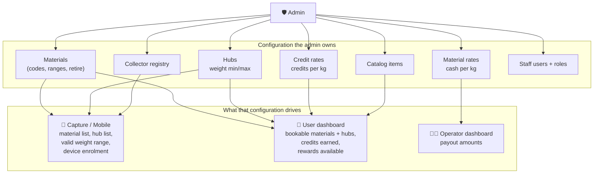
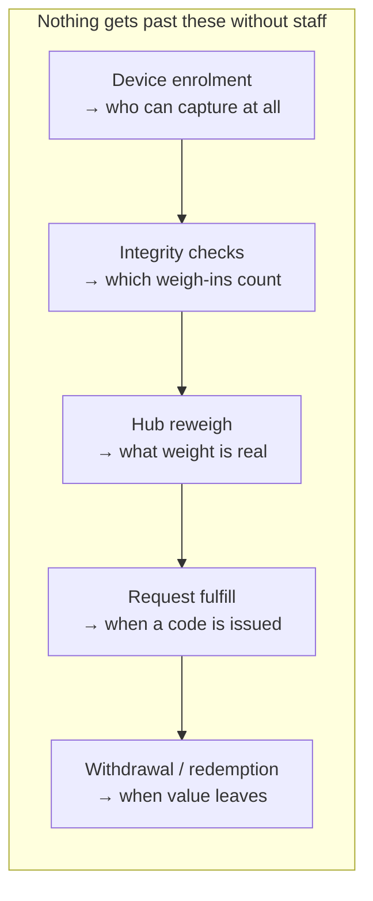

# 3. Admin Oversight

The admin sits above all three surfaces. Nothing in capture, mobile or the user
dashboard is self-governing — every one of them depends on configuration the
admin owns, and every consequential action lands in a queue the admin's staff
work through.

## Roles

| Role | Can do |
| --- | --- |
| **admin** | Everything an operator can, **plus**: create/deactivate users, define materials, set credit rates and material rates, create catalog items, delete collectors |
| **operator** | Day-to-day: batches, weigh-ins, reweigh, payouts, requests (assign/fulfill/cancel), withdrawals, catalog fulfillment, collector registry |
| **auditor** | Read-only — payouts and batch reports |

`Role` is a claim on the staff JWT (`apps/backend/src/auth/auth.module.ts`) and
is enforced server-side by `@Roles(...)` on every controller method. The
dashboard nav hides what a role cannot use, but the guard is the actual
boundary, not the nav.

One deliberate note from the code: the JWT is a 12-hour snapshot, so it is only
ever used for *who is asking*. Anything depending on current account state
re-reads the row — a user demoted five minutes ago still holds a token saying
otherwise.

## What the admin controls, and which app it governs

The dependency is real and one-directional. If no credit rate exists for a
material, `WalletService.redeem` throws with an explicit message telling the
operator to `POST /credit-rates` — a user simply cannot be credited for a
material the admin has not priced.

## Oversight over the capture app

The admin/operator controls the field phones entirely:

- **Device enrolment.** A phone only works after an operator signs in on it once
  and enrols its ed25519 public key against a collector (`POST /devices`). The
  operator token is used for that one step and never persisted on the phone.
- **Collector registry.** Operators create and list collectors; **admins alone**
  can deactivate or delete them. A weigh-in from a device whose collector is
  gone fails the `device enrolled` integrity check.
- **Hubs and weight ranges.** Each hub's `minWeightKg`/`maxWeightKg` is the
  bound the `weight_in_range` integrity check enforces. The admin setting a
  range directly determines which field weigh-ins are accepted.
- **Materials.** The catalogue capture shows comes from the backend; retiring a
  material stops new weigh-ins against it.
- **Quarantine review.** Anything failing integrity is visible on
  `/(operator)/events` with the raw findings — the untranslated check names live
  on the server record for operators, while the collector sees plain-language
  copy on their phone.

## Oversight over the user dashboard

- **Request queue** (`/(operator)/requests`) — every request, every status, with
  counts. Assign, fulfill, cancel. This page is also where the operator can see
  and print the QR for a collected request.
- **Reweigh** (`/(operator)/reweigh`) — the gate. No request can be fulfilled
  until an event here has a non-`rejected` reweigh, so the admin's staff decide
  what weight a user is credited for.
- **Withdrawals** (`/(operator)/withdrawals`) — every cash-out sits `pending`
  until staff mark it paid or reject it. Money never leaves without a staff
  action.
- **Catalog redemptions** (`/(operator)/catalog-redemptions`) — same shape for
  physical rewards.
- **Credit rates** (admin only) — sets what every kilogram of every material is
  worth to every user, globally or per hub, with time-effective versions.

## The admin's control points, in order of leverage

Every one of the five is a staff action or a server rule the admin configures.
There is no path from "a collector typed a number" to "a user has spendable
value" that does not cross all five.

## Audit trail

- **Batch reports** (`GET /batches/:id/report`) — events, Merkle proofs, sealed
  root, chain of custody, reweighs and payouts. Independently recomputable by a
  third party. Auditors have read access without any write capability.
- **Wallet ledger** — every credit and debit is an immutable row with a
  description, the linked request and the linked event. Balance is derived, so
  there is no balance field that can drift from its history.
- **Redemption stamps** — `redemptionCode`, `redeemedAt` and `eventId` on the
  request row tie a user's credit back to one specific signed weigh-in and one
  specific hub verification.
